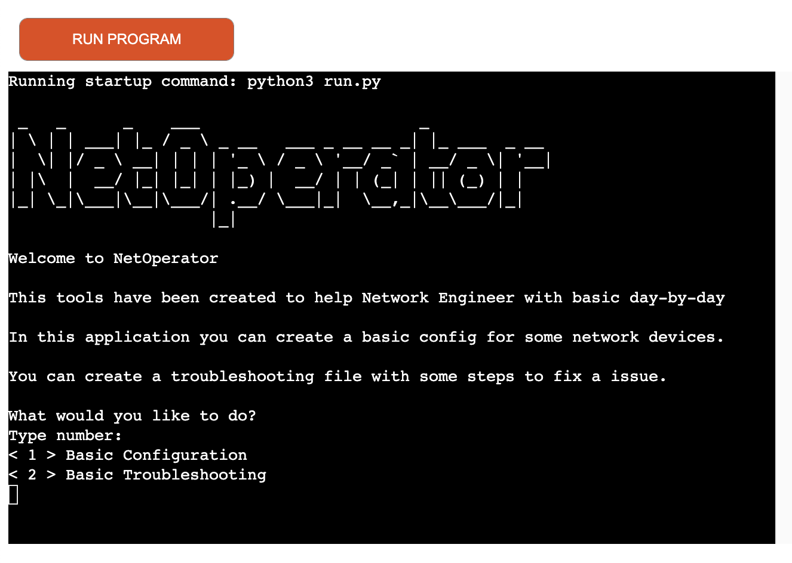
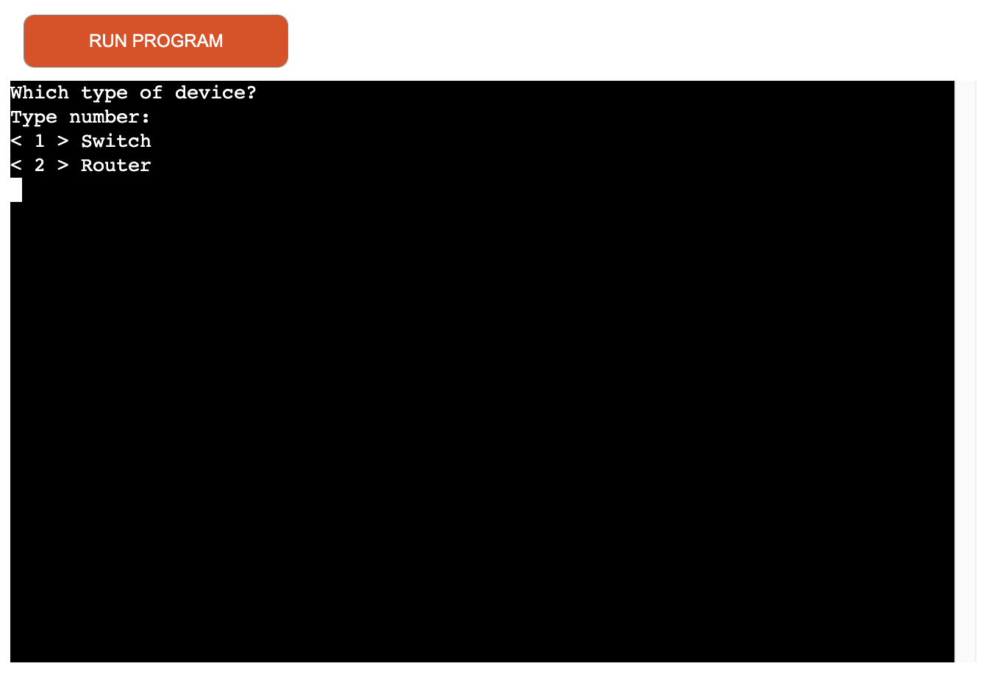
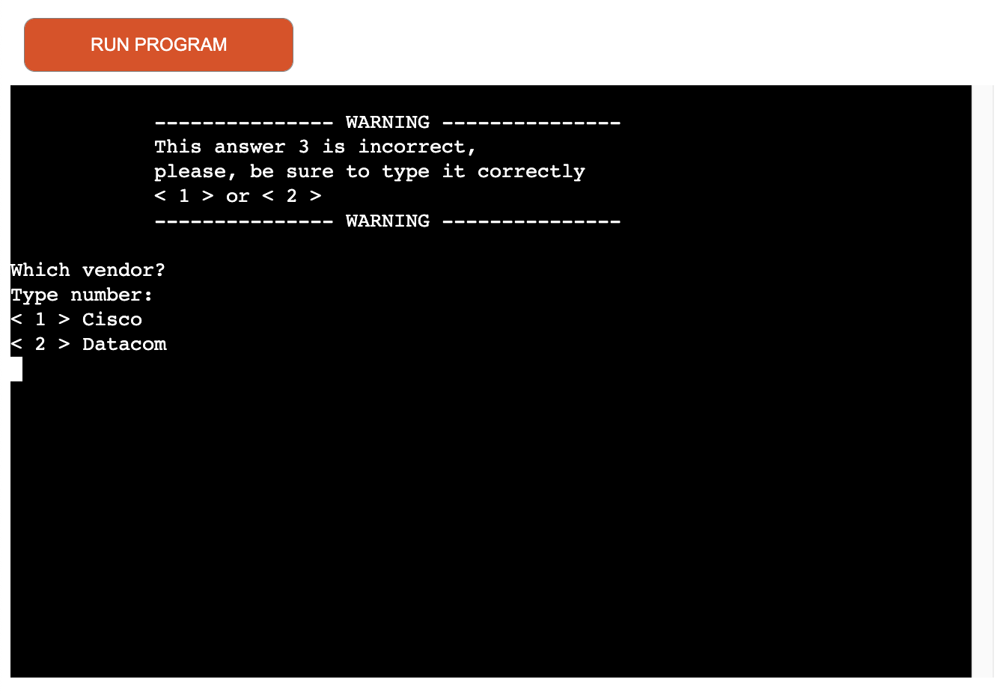
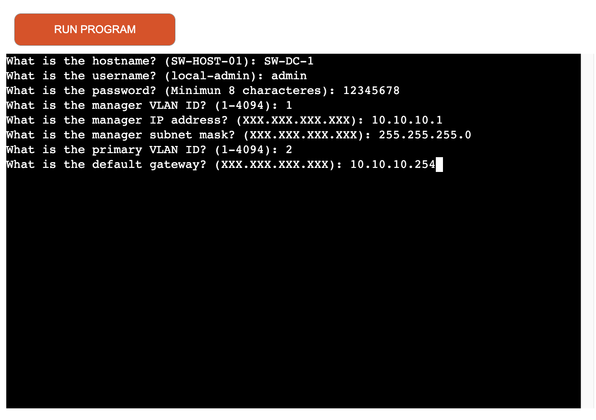
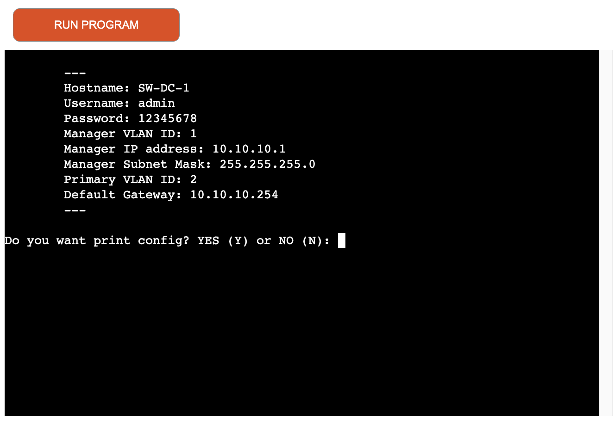
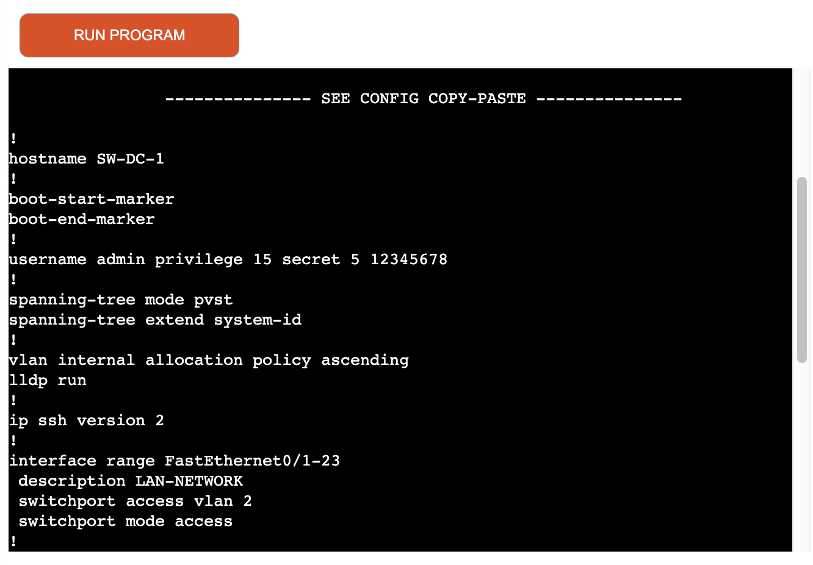
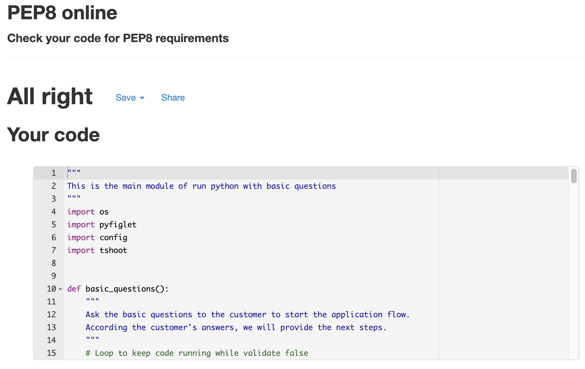
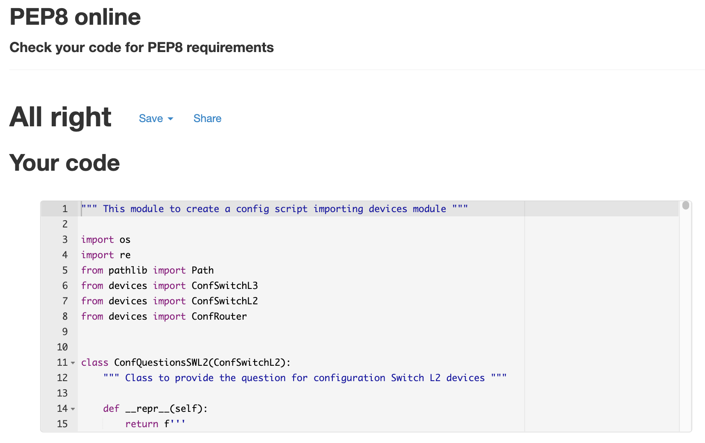
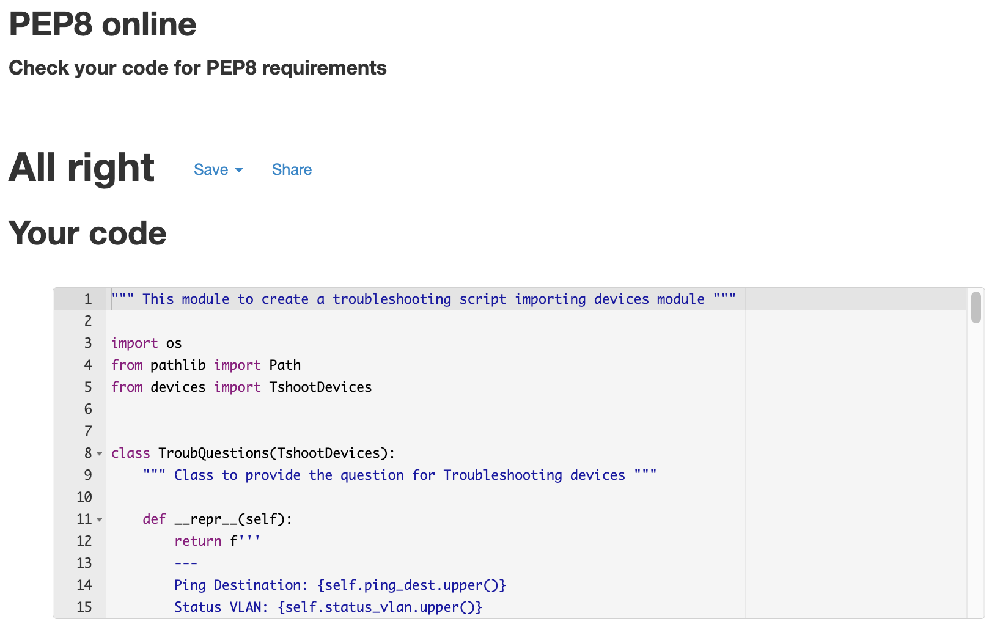
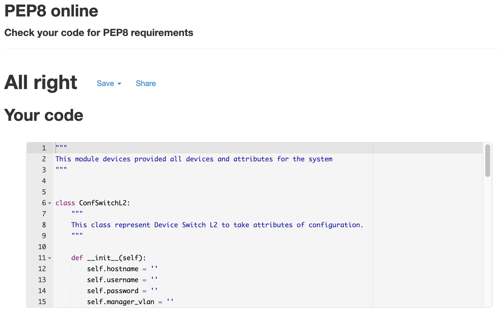

# NetOperator


This tool can help Network Engineers create basic configurations to set up Switches and Routers (Network Devices). 

With NetOperator you can create instructions for basic troubleshooting for network devices depending on your answers.

As you can see this tool is designated for Network Professionals and have specific terms that are not familiar to everyone.

Currently, the tool has 2 vendors available for configuration and troubleshooting (Cisco and Datacom).

You can configure Switches in Layer2, Layer3 and Routers.

I hope this tool can help the day-by-day Network Engineer.

[Click here to access the tool](https://netoperator.herokuapp.com/)

## User Experience (UX)
---

### Vision
    The idea for this tool is to provide an application that can help Network Engineers with day-by-day.

### Aims
    To provide users an application they can go to when they want:

    - Creating a basic configuration to set up Network Devices (Switches and Routers).
    - Creating a basic troubleshooting commands to find and fix issues with Network Devices.

### Target Audience
    Network Professionals:

    - Network Engineer
    - Network Security Engineer
    - Network Administrator
    - Help Desk Technical
    - Network Architect
    - Network Specialist
    - Field Support
    - IT Engineer
    - Desktop Engineer

### User Stories

1. I want to be able to set up a Switch Layer2/Layer3 or Router with a basic configuration.

2. I want to be able to set up a basic configuration in a network device for a Sr. Engineer execute a remote access and complete the set up.

3. I want to be able to do a troubleshooting in network device to find a cause of issue and fix it.

4. I want to be able to change a basic configuration with a command script.

5. I want to be able to copy and paste the configuration from the application to the device.

6. I want to be able to use valid IPs and Subnet Mask in the configuration.

7. I want to be able to provide a basic configuration with security standard commands for anyone execute the first set up.


### User Flow Chart


### Program Flow Chart


### Design 

#### First Page


#### Second Page for Configuration


#### If put wrong answer


#### Providing answers to the questions


#### Printing Answers 


#### Configuration Provided



## Features 

Here describes the main features of the website and what the user can expect when viewing ~

### Existing Features:

 - Basic configuration for Switch Layer 2 Cisco and Datacom
 - Basic configuration for Switch Layer 3 Cisco and Datacom
 - Basic configuration for Router Cisco and Datacom
 - Basic troubleshooting for Network Devices: ICMP, Routing, Network layer and others
 - Print the config commands and troubleshooting commands in the page for copy/paste

### Future Features:

 - Download the commands in a file .txt
 - More vendors like Aruba, HPE, 3Com and others
 - More devices configs and troubleshooting commands like Access Points, Firewall and others
 - More segregation questions and versions of appliances 

## Technologies 
### **Dev Languages Used**
  
  - Python
  
### **Applications Used**
  
  - [GitPod](https://www.gitpod.io/) was used as an online IDE.
  - [GitHub](https://github.com/) is used to store the projects code and version control.
  - [Heroku](https://dashboard.heroku.com/) are used to deploy the site.
  - [Character Count](https://www.charactercountonline.com/older-versions/v2/) was used to add commit with max 50 characteres.
  - [W3Schools](https://www.w3schools.com/) was used to reference code for Python.
  - [Lucidchart](https://www.lucidchart.com/) was used to create a user flow and sitemap.
 
## Testing 

### PEP8
#### Run.py


#### Config.py


#### Tshoot.py


#### Devices.py


### Bug

 - No bugs.
 - I have some difficult some processes for validation and keep questions running while the customer provide the correct answer.

## Deployment 

Deploying the project using Heroku:
* Visit the [Heroku](https://dashboard.heroku.com/login) site and create an account
* Click the "New" Button
* Click the "Create new app" button
* Provide a name for the app in the App name input field
* Select your region from the choose region dropdown menu 
* Click the "Create App" button
* Once redirected, proceed to the settings tab
* Click on the "config vars" button
* Supply a KEY of `PORT` and it's value of `8000`. The click the "add" button
* Next step is to add Buildpacks, click the "Add Buildpack" button
* The `python` buildpack needs to be added first then the `nodejs` buildpack
* Once the buildpacks have completed, go to the deploy screen, once in the deploy screen, select GitHub as the deployment method and connect your GitHub profile
* Search for the repository that you wish to deploy to Heroku and click "connect"
* Once your repository is connected to Heroku you can choose to either manually or automatically deploy your app.
* By selecting automatic deploys, Heroku will build a new version of the app each time a change has been pushed to the repository
* Manual deploys allow you to build a new version of your app whenever you click manual deploy
* If your build is successful you will then be able to visit the live site by clicking the link that is provided to you by Heroku

Command to add packages to requirements.txt, `pip3 freeze --local > requirements.txt` 

### Making a Local Clone

1. Log in to GitHub and locate the [GitHub Repository](https://github.com/michaelrfreitas/p3_py_netoperator)
2. Under the repository name, click "Clone or download".
3. To clone the repository using HTTPS, under "Clone with HTTPS", copy the link.
4. Open Git Bash
5. Change the current working directory to the location where you want the cloned directory to be made.
6. Type `git clone`, and then paste the URL you copied in Step 3.

    $ `git clone https://github.com/michaelrfreitas/p3_py_netoperator` 

7. Press Enter. Your local clone will be created. 

```shell
$ git clone https://github.com/michaelrfreitas/p3_py_netoperator
> Cloning into `CI-Clone`...
> remote: Counting objects: 10, done.
> remote: Compressing objects: 100% (8/8), done.
> remove: Total 10 (delta 1), reused 10 (delta 1)
> Unpacking objects: 100% (10/10), done.
```

Alternatively, if using Gitpod, you can click below to create your own workspace using this repository.

You will need to also install all required packages in order to run this application on Heroku, refer to [requirements.txt](requirements.txt)
* Command to install this apps requirements is `pip3 install -r requirements.txt`

# Credits 
  ### **Images**
  The answer images were downloaded from:

  - [Cisco](https://cisco.com/)
  - [PlanetTechnology](https://planetechusa.com/switch-vs-router-what-is-the-difference/)

  ### **Code/Reference** 
  - [GeeksforGeeks](https://www.geeksforgeeks.org/python-program-to-validate-an-ip-address/)
  - [W3Schools](https://www.w3schools.com/python/python_datetime.asp)   
  - [Code Institute](https://www.CodeInstitute.net)
  - [DatatoFish](https://datatofish.com/copy-file-python/)
  - [Real Python](https://realpython.com/working-with-files-in-python/)
  - [Study Tonight](https://www.studytonight.com/python-howtos/search-and-replace-a-text-in-a-file-in-python)
  - [StackOverflow](https://stackoverflow.com)
  
  
  ### **Acknowledgment**
  I'd like to say thank you my mentor [Benjamin Kavanagh](https://github.com/BAK2K3) for his guidance and support throughout my project.

