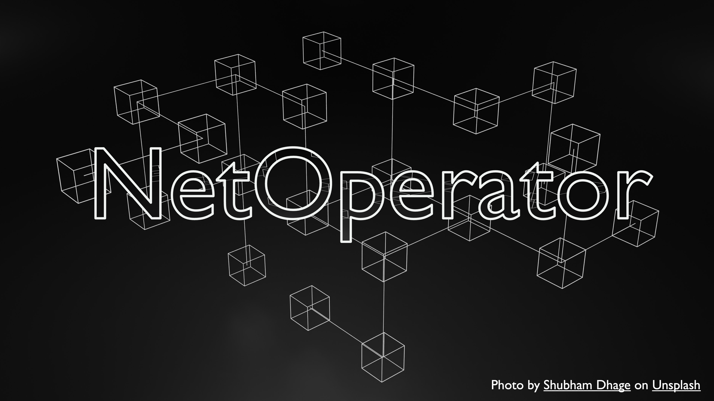

# NetOperator

This is a tool that can help Network Engineers to create basic configuration to network devices as Switches and Routers. With NetOperator you can create a file with instructions for a basic troubleshooting for devices Layer 2 and Layer 3.

As you can see this tool is designated to Network Professionals and have specific terms that is not familiar to everyone.

[Click here to access the tool](https://the-hunters.herokuapp.com/)

## User Experience (UX)

### User Flow Chart

### Dev Flow Chart

* Your code must be placed in the `run.py` file
* Your dependencies must be placed in the `requirements.txt` file
* Do not edit any of the other files or your code may not deploy properly

## Creating the Heroku app

When you create the app, you will need to add two buildpacks from the _Settings_ tab. The ordering is as follows:

1. `heroku/python`
2. `heroku/nodejs`

You must then create a _Config Var_ called `PORT`. Set this to `8000`

If you have credentials, such as in the Love Sandwiches project, you must create another _Config Var_ called `CREDS` and paste the JSON into the value field.

Connect your GitHub repository and deploy as normal.

## Constraints

The deployment terminal is set to 80 columns by 24 rows. That means that each line of text needs to be 80 characters or less otherwise it will be wrapped onto a second line.

-----
Happy coding!